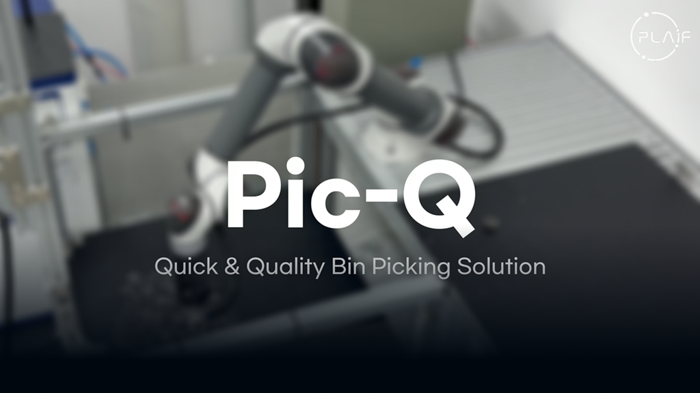

# picq-manual
mkdocs 기반의 매뉴얼입니다. PLAIF Pic-Q의 사용법을 가이드합니다.
[](https://www.youtube.com/watch?v=04Uzk1nE3Lc)

### 배포 페이지 가기
https://plaif.github.io/picq-manual/
### How to use
```
$ https://github.com/plaif/picq-manual.git # Clone
$ pip install mkdocs # 개발환경 설치
$ python3 -m mkdocs serve # 로컬 테스트
$ python3 -m mkdocs gh-deploy # 이건 GitHub Actions로 자동화되므로 필요 없습니다.
```
