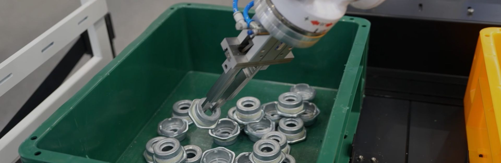
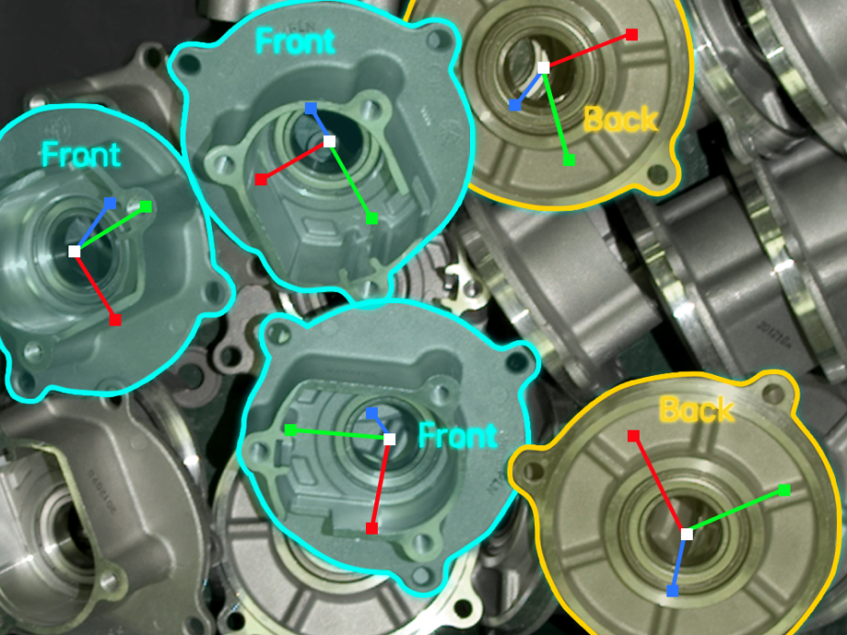
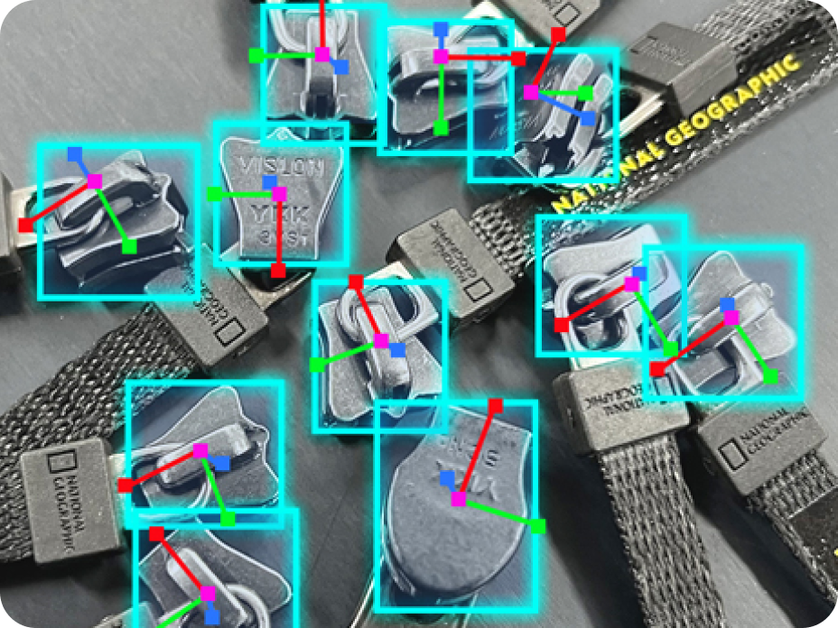
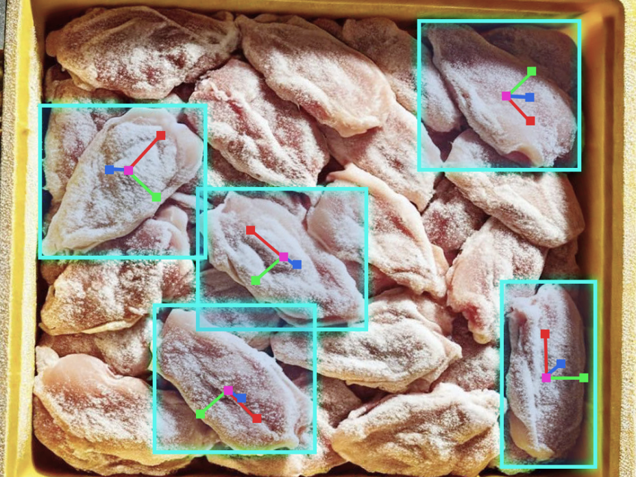
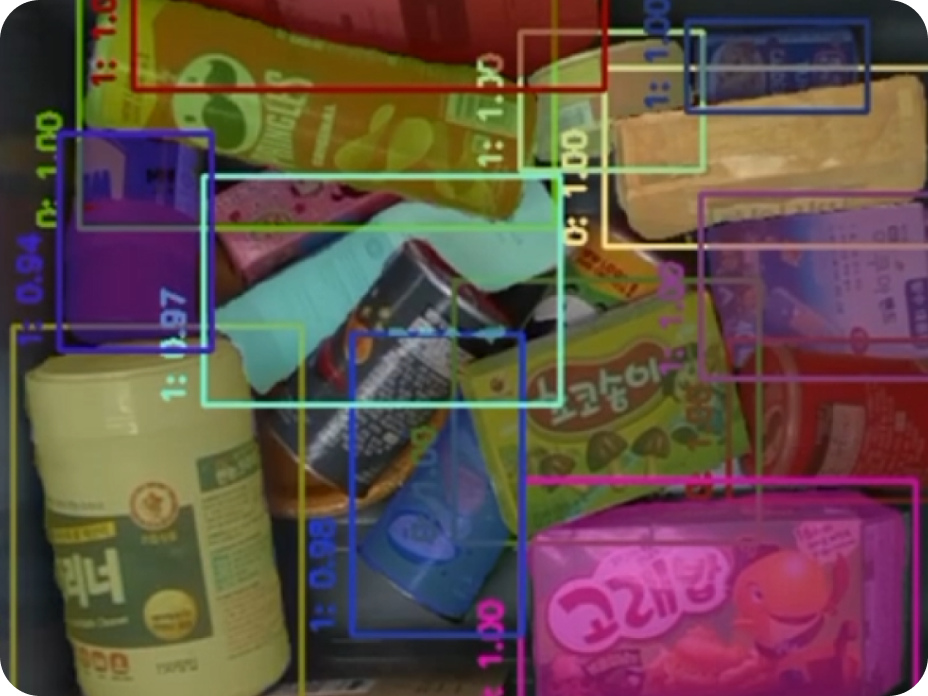
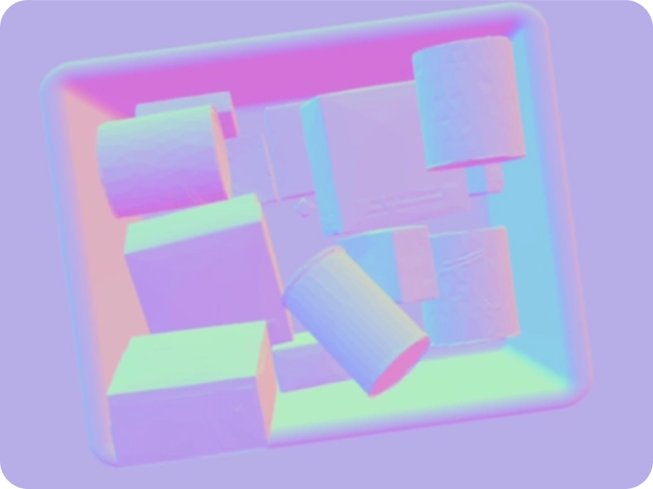
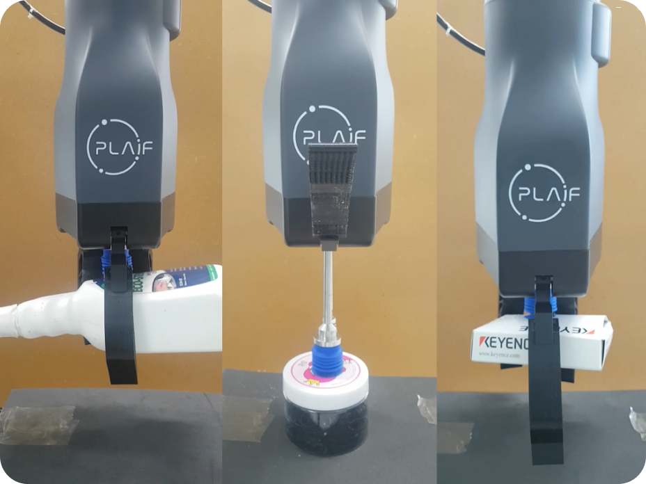

# Home

<h2 style="color: #00C2FF;">금속 및 비정형 물체에 대한 강한 대응력</h2>

플라잎의 독자적인 AI 모델이 탑재된 AI 3D 카메라는 복잡한 환경에서도 신속한 이미지 처리와 뛰어난 인식 성능을 제공합니다.  
무작위로 배치된 물체의 위치와 자세를 추정하는 고도의 인식 기술은 금속 물질에도 뛰어난 성능을 발휘할 수 있습니다.

<h3 style="color: #00C2FF;">재질·크기·형태까지 다양한 대상 물체에 대한 우월한 인식 능력</h3>
<table>
  <tr>
    <td width="33%">
       
      <strong>광택이 있는 금속 부품</strong> 
      자동차 부품과 같이 반사되어 3D 이미지 처리에 문제를 발생시킬 수 있는 금속 물체도 안정적으로 위치와 자세를 파악할 수 있습니다.
    </td>
    <td width="33%">
       
      <b>인식이 어려운 소형 부품</b> 
      지퍼와 같이 한층 더 정밀한 피킹 솔루션이 요구되는 소형 물체에 대한 최상의 파지 자세를 추정합니다.
    </td>
    <td width="33%">
       
      <strong>형상이 제각각인 비정형 제품</strong> 
      3D 비전과 딥러닝, 강화 학습 기반의 AI 모델은 평평하거나 반복되지 않은 비정형 제품도 식별하고 피킹 포인트를 인식합니다.
    </td>
  </tr>
</table>
 
<h3 style="color: #00C2FF;">물체의 형체와 각도가 혼재된 상황에서 혼합형 물체에 최적화된 피킹 능력</h3>
<table>
  <tr>
    <td width="33%">
       
      <strong>개별 물체의 정확한 식별 및 분리</strong> 
        AI 모델이 각각의 물체를 정확히 구분하여 개별 물체를
        식별할 수 있으므로, 다수의 물체가 혼재된 상황에서도
        개별 피스 피킹이 가능합니다.
    </td>
    <td width="33%">
       
      <b>복잡한 형태의 물체에 대한 대응력</b> 
        포즈&뎁스 추정 모델을 통해 다양한 각도와 형태의 물체를
        파악하여, 불규칙한 형상이나 여러 자세로 놓인 물체도
        안정적으로 집을 수 있습니다.
    </td>
    <td width="33%">
       
      <strong>추가 학습이 필요 없는 피킹 슈퍼모델</strong> 
        다양한 제품을 피킹 하기 위한 슈퍼모델을 제공함으로써
        추가 학습 없이 효과적으로 물체를 집을 수 있습니다.
    </td>
  </tr>
</table>

